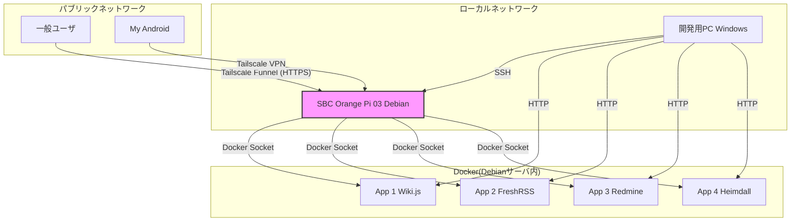
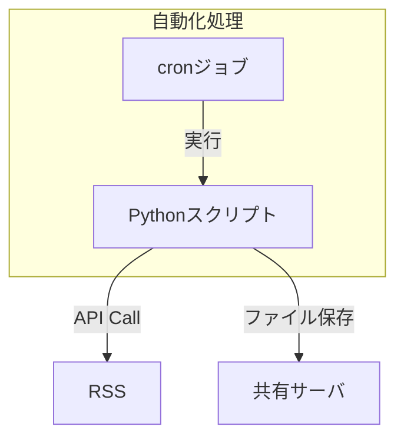

# 自宅学習用サーバ インフラ構成管理リポジトリ (My Homelab)

> **概要:** Linux(Debian)を搭載したSBC (Orange Pi)上で、Docker, Python, Tailscale等を活用して構築した自宅学習環境です。Webアプリケーションの運用、日々の作業自動化の実践の場として改善を重ねています。

## ✨ 設計思想

この環境は、以下の3つの原則に基づいて設計・構築しています。

1.  **セキュリティの確保:**
    *   ルーターのポートを直接開放するのではなく、**Tailscale**を全面的に採用。`Tailscale Funnel`機能で特定のサービスのみを安全にインターネットへ公開し、セキュリティを確保しています。

2.  **分離と安定的運用:**
    *   **Docker**によりアプリケーションをコンテナ化し管理しています。依存関係の衝突を回避し、コンテナに利用メモリの上限を設定することで、SBCのメモリ圧迫を阻止しています。

3.  **生活に根差した自動化:**
    *   **Pythonとcron**を使い、「実生活で役立つ自動化」を追求しています（後述のラジオ録音システムなど）。

## 📖 アーキテクチャ構成図

## 📖 自動化構成図

## 🛠️ 主なアプリケーションと役割

| コンテナ名 | 役割 | なぜ導入したか |
| :--- | :--- | :--- |
| **Heimdall** | アプリケーションポータル | 各サービスへの入り口。 |
| **Wiki.js** | ナレッジベース | サーバの構築手順や学習メモなどを集約。 |
| **FreshRSS** | RSSリーダー | 情報の効率的な収集。 |
| **Redmine** | プロジェクト管理 | 個人の学習タスクを管理。 |

## 🤖 自動化 : ラジオ録音システム

日々の情報収集の一環として、ラジオ番組の自動録音・配信システムを構築しています。

*   **実行トリガー:** `cron`により、毎週指定した時刻にPythonスクリプトを実行。
*   **録音処理:** Pythonスクリプトが`Podcast`などのRSSにアクセスし、対象の番組をダウンロード。
*   **ファイル共有:** ダウンロードされたファイルは、Sambaで共有されたストレージ領域に保存。
*   **聴取:** **Tailscale VPN**経由で、Androidスマートフォンから自宅ネットワークの共有ストレージに安全にアクセスし、いつでもどこでも録音を聴くことが可能。

`#Linux` `#Docker` `#Python` `#Automation` `#Networking` `#Security`
