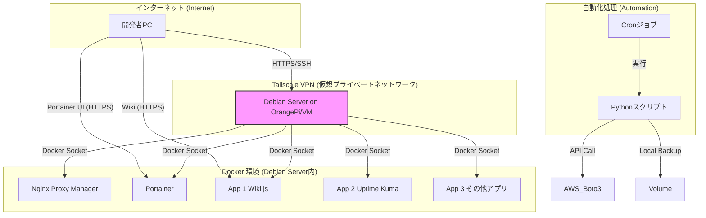

# 自宅学習用サーバ インフラ構成管理リポジトリ

> **概要:** Linux(Debian), Docker, Python, Tailscaleを活用した自宅学習環境のインフラ構成をコードとドキュメントで管理するリポジトリです。学習と実践の場として、日々改善を重ねています。

## 📖 アーキテクチャ構成図 (Architecture)

このサーバは、セキュリティを確保しつつ外部から安全にアクセスするため、TailscaleによるVPNを基盤としています。サーバ内ではDockerを利用して各アプリケーションをコンテナとして分離・管理し、メンテナンス性と再現性を高めています。

